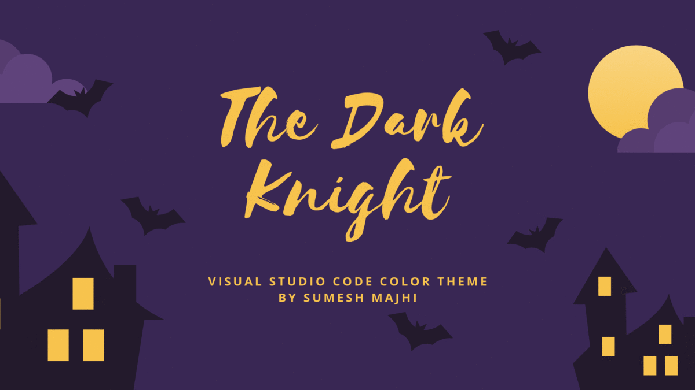

# 

  |The Dark Knight ⚡
------------ | -------------

 =  |  +  + 
------------ | -------------

#### *⚠ This is a temporary version of this color sceme, The theme will be going to take a lot of up's📈 and down's💹 during its development process so hold on tight and enjoy the roller-coaster ride.*

Author | ⚡[Sumesh Majhi](https://github.com/MajhiRockzZ) ⚡ 
------------ | -------------
Version | 
Rating | 
License | 
Install | 
Size | 

It was really time consuming to setup you code editor overtime you switch different machine. Also I have been always switching back and forth from one color scheme to other according to my preference as not all color scheme will have what you want for your perfect setup. So I decided to build my own and here it is hope you will love it as i do. The Dark Knight is a theme created using some of the best features from my three favourite color scheme [Dracula](https://github.com/dracula/visual-studio-code), [Night Owl](https://github.com/sdras/night-owl-vscode-theme), and [Shades of Purple](https://github.com/ahmadawais/shades-of-purple-vscode) a huge thanks to them for their great work.

## Installation

1. Install [Visual Studio Code](https://code.visualstudio.com/)
2. Launch Visual Studio Code
3. Choose **Extensions** from menu
4. Search for `The Dark Knight`
5. Click **Install** to install it
6. Click **Reload** to reload the Code
7. From the menu bar click: Code > Preferences > Color Theme > **The Dark Knight**

## Features
What makes your project stand out?

## Best Settings & Options Guide

#### *📌 Below setup will help you get the custom theme setting for the PowerShell, command line tool on windows.*

* 
  * Download and Install [Visual Studio Code](https://code.visualstudio.com/).

* 
  * Download and Install [Operator Mono Font](https://www.typography.com/fonts/operator/styles) .
* 
  * Powerline for Windows ➡ This [Resource](https://gist.github.com/jchandra74/5b0c94385175c7a8d1cb39bc5157365e) by [Jimmy Chandra](https://github.com/jchandra74).
* 
  * Download and Install [Powerline font](https://github.com/powerline/fonts)
  * Alternative [Menlo for Powerline](https://github.com/abertsch/Menlo-for-Powerline) .
* 
  * Open ``Visual Studio Code Image``.
  * On left menu click ``Extension`` Icon.
  * Search for ``The Dark Knight`` by [Sumesh Majhi](https://github.com/MajhiRockzZ).
  * Click ``Intall`` and ``Set Color Theme``

    **or just**
  * Follow this [link](http://bit.ly/vsce-the-dark-knight).
  * Click ``Install`` then select ``Visual Studio Code Image`` and **open link**
* 
  * Oh My Posh setup [guide](https://github.com/JanDeDobbeleer/oh-my-posh) by [Jan De Dobbeleer](https://github.com/JanDeDobbeleer)
* 
  * Setup [Operator Mono Ligatures](https://github.com/kiliman/operator-mono-lig) by [Kiliman](https://github.com/kiliman)

#### *💝 At this moment your powershell for windows will look something like this.*

#### *⚡ Now if you select powershell as your default terminal in ``vscode`` your will get something like this.*

#### *⚡Thats all now you have your awesome development environment to create next big thing.⚡*

## Credits

* [Visual Studio Code Docs](https://code.visualstudio.com/docs) for ``Publishing Extension`` [doc](https://code.visualstudio.com/api/working-with-extensions/publishing-extension).
* [Canva](https://www.canva.com/) for ``icon, banner, and other designs``.
* [Dracula](https://github.com/dracula/visual-studio-code) for ``inspiration`` by [Dracula Theme](https://github.com/dracula) ⚡.
* [Night Owl](https://github.com/sdras/night-owl-vscode-theme) for ``inspiration`` by [Sarah Drasner](https://github.com/sdras) ❤.
* [Shades of Purple](https://github.com/ahmadawais/shades-of-purple-vscode) for ``inspiration`` by [Ahmad Awais ⚡️](https://github.com/ahmadawais).
* [Sarah Drasner](https://css-tricks.com/author/sdrasner/) for ``Creating a VS Code Theme`` [blog](https://css-tricks.com/creating-a-vs-code-theme/).
* [Akash Nimare](https://github.com/akashnimare) for ``A Beginners Guide to writing a Kickass README`` [gist](https://gist.github.com/akashnimare/7b065c12d9750578de8e705fb4771d2f).
* [ColorSublime](https://colorsublime.github.io/) for color scheme ``inspiration``.
* [Operator Mono Ligatures](https://github.com/kiliman/operator-mono-lig) for ``OpenType fonts generate  for Operator Mono that includes ligatures`` by [Kiliman](https://github.com/kiliman).
* [oh-my-posh](https://github.com/JanDeDobbeleer/oh-my-posh) ``repository`` by [Jan De Dobbeleer](https://github.com/JanDeDobbeleer).
* [Operator Mono Fonts](https://www.typography.com/fonts/operator/styles) for such an ``awesome fonts``.
* [Jimmy Chandra](https://gist.github.com/jchandra74) for ``Pimping Up Your PowerShell & Cmder with Posh-Git, Oh-My-Posh, & Powerline Fonts`` [gist](https://gist.github.com/jchandra74/5b0c94385175c7a8d1cb39bc5157365e).
* [Alex Bertsch](https://github.com/abertsch) for ``Menlo for Powerline`` [repository](https://github.com/abertsch/Menlo-for-Powerline).
* [Powerline](https://github.com/powerline) for [Powerline](https://github.com/powerline/powerline) and [Powerline fonts](https://github.com/powerline/fonts) ``repository``.
* [Growing with the Web](https://www.growingwiththeweb.com/) for ``Mastering VS Code's Terminal`` [blog](https://www.growingwiththeweb.com/2017/03/mastering-vscodes-terminal.html) by [Daniel Imms](https://www.growingwiththeweb.com/p/about.html).
* [Yeoman](https://yeoman.io/) for ``Yeoman generator for Visual Studio Code Extensions``

### Contact / Social Media

#### *Get the latest News about Web Development, Open Source, JavaScript & React*

## License

This work by [Sumesh Majhi](https://www.twitter.com/MajhiRockzZ) is licensed under a  [MIT License](https://github.com/MajhiRockzZ/the-dark-knight/blob/master/LICENSE)

MIT © [MajhiRockzZ](https://www.twitter.com/MajhiRockzZ)

  📌| 
------------ | -------------
