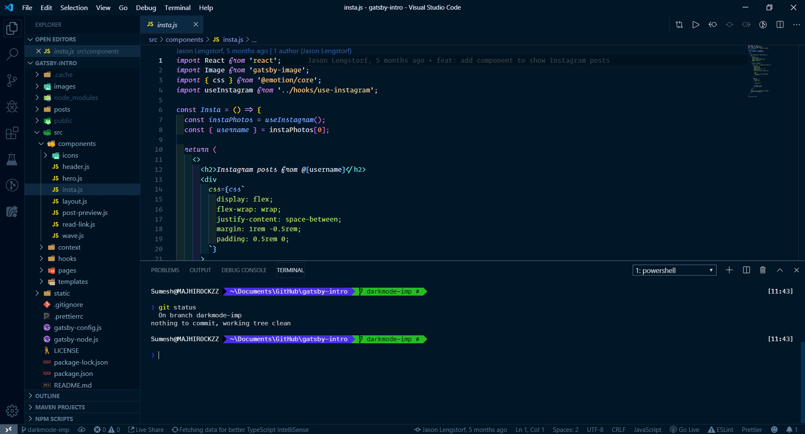

# ⚡ The Dark Knight 🦇

It was really time consuming to setup you code editor overtime you switch different machine. Also i have been always switching back and forth from one color scheme to other according to my preference as not all color scheme will have what you want for your perfect setup. And have a feature for color scheme community was really time consuming. So I decided to build my own and here it is hope you will love it as i do.

## Build status

## Screenshots

## Features

## Installation

1. Install [Visual Studio Code](https://code.visualstudio.com/)
2. Launch Visual Studio Code
3. Choose **Extensions** from menu
4. Search for `MajhiRockzZ.the-dark-knight`
5. Click **Install** to install it
6. Click **Reload** to reload the Code
7. From the menu bar click: Code > Preferences > Color Theme > **The Dark Knight**

## Credits

[Sumesh Majhi](https://github.com/MajhiRockzZ)

